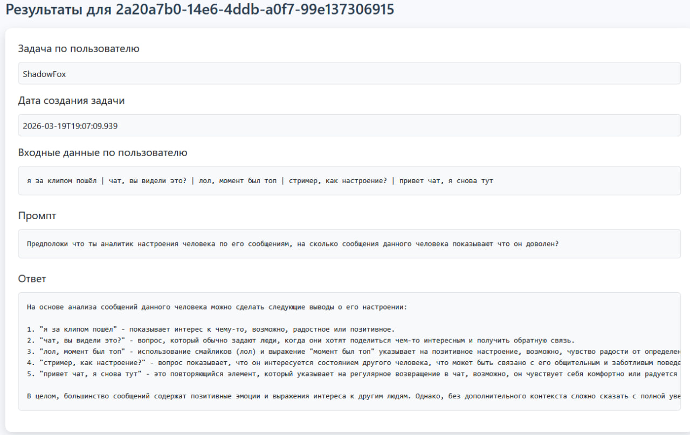
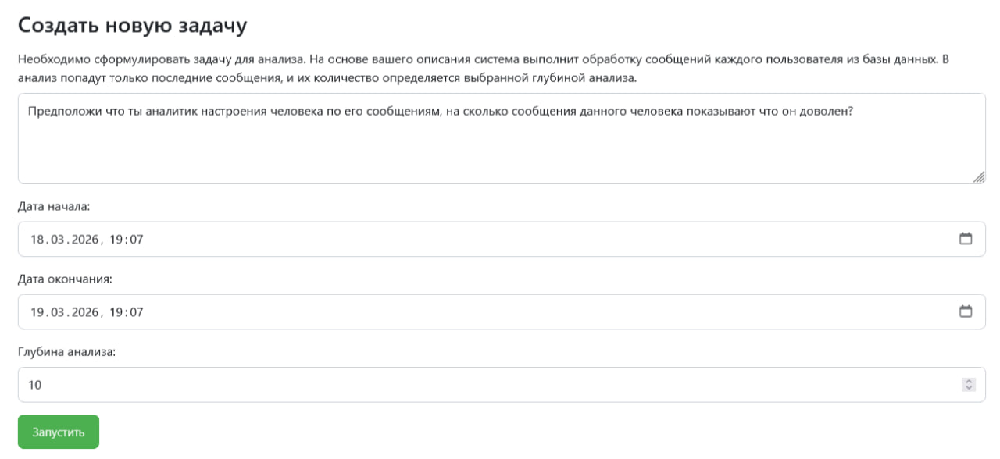

# TwPersonaAI

TwPersonaAI — это приложение, которое связывает локальную языковую модель, запущенную в LM Studio, с чатом на Twitch. Оно работает как прослойка между зрителями и локальным ИИ - собирает сообщения из чата, сохраняет их в базе данных, позволяет использовать ИИ для ответов зрителям или анализа накопленных данных.

После запуска TwPersonaAI начинает фоново сохранять сообщения зрителей в SQLite. При включении режима автоответов, приложение передаёт в ИИ недавние сообщения зрителей вместе с промптом, который задаёт характер личности и стиль поведения ИИ, далее TwPersonaAI выводит ответ ИИ на экран OBS. Активация автоответов и настройка системного промпта личности ИИ выполняется через страницу настроек - http://localhost:8080/settings.

Помимо общения со зрителями, TwPersonaAI умеет выполнять задачи по анализу истории сообщений. Задача формируется в виде промпта, TwPersonaAI собирает все сообщения за указанное время, разбивает их по пользователям и выполняет задачу из указанного промпта. Если в чате было 3 пользователя и каждый написал по 10 сообщений, то TwPersonaAI сформирует три группы (по 1 на пользователя, формата User:message1|message2...) и в рамках каждой группы выполнит задачу по отдельности (ну или не выполнит, используется локальная модель все же, а не киборг убийца). Глубина анализа указывает на кол-во сообщений пользователя которое следует взять во внимание во время выполнения задачи. Все задачи выполняются по очереди, их можно удалять/останавливать. Постановка задач и результаты выполнения - http://localhost:8080/analysis.

Для отображения ответов ИИ на стриме используется OBS. Внутри OBS нужно создать источник типа браузер и указать - http://localhost:8080/ai/answers. После этого ответы модели будут появляться на экране поверх трансляции.

Проект создавался как быстрый прототип. ИИ‑агенты для создания проекта не использовались, но генерация классов и методов частично выполнялась с помощью Copilot.

Перед запуском TwPersonaAI нужно включить режим разработчика в LM Studio и запустить LM Studio Server с выбранной вами моделью. После этого TwPersonaAI сможет обращаться к локальной LLM и использовать её для ответов и анализа сообщений.

В TwPersonaAI требуется указать OAuth‑ключ от Twitch. Его можно задать через переменные окружения или в файле .env.local.properties. Пример формата находится в файле .env. Дополнительные параметры можно посмотреть в application.properties. Далее, проект можно собрать в jar или запустить напрямую через spring‑boot:run.

Для тестирования, можно добавить в базу SQLite синтетические данные, например через DB Beaver:

```
INSERT INTO messages
(id, answered, message, name, "source", "timestamp")
VALUES
(500, 0, 'привет чат, я снова тут', 'ShadowFox', 'TWITCH', 1773933000000),
(501, 0, 'стример, как настроение?', 'ShadowFox', 'TWITCH', 1773933060000),
(502, 0, 'лол, момент был топ', 'ShadowFox', 'TWITCH', 1773933120000),
(503, 0, 'чат, вы видели это?', 'ShadowFox', 'TWITCH', 1773933180000),
(504, 0, 'я за клипом пошёл', 'ShadowFox', 'TWITCH', 1773933240000),
(505, 0, 'привет всем, что пропустил?', 'LunaCat', 'TWITCH', 1773933600000),
(506, 0, 'ого, красиво сделал', 'LunaCat', 'TWITCH', 1773933660000),
(507, 0, 'чат, плюс если кайфуете', 'LunaCat', 'TWITCH', 1773933720000),
(508, 0, 'стример, музыка топ', 'LunaCat', 'TWITCH', 1773933780000),
(509, 0, 'я на минутку отходил', 'LunaCat', 'TWITCH', 1773933840000),
(510, 0, 'кто тут олд?', 'OldSchooler', 'TWITCH', 1773934200000),
(511, 0, 'я с тобой с 2021', 'OldSchooler', 'TWITCH', 1773934260000),
(512, 0, 'чат, помните тот стрим?', 'OldSchooler', 'TWITCH', 1773934320000),
(513, 0, 'стример, ты вырос', 'OldSchooler', 'TWITCH', 1773934380000),
(514, 0, 'ностальгия прям', 'OldSchooler', 'TWITCH', 1773934440000),
(515, 0, 'лол, у меня всё зависло', 'LagMaster', 'TWITCH', 1774019400000),
(516, 0, 'чат, у вас тоже?', 'LagMaster', 'TWITCH', 1774019460000),
(517, 0, 'почему такая задержка?', 'LagMaster', 'TWITCH', 1774019520000),
(518, 0, 'я перезапущу стрим', 'LagMaster', 'TWITCH', 1774019580000),
(519, 0, 'всё, вроде норм', 'LagMaster', 'TWITCH', 1774019640000),
(520, 0, 'стример, чекни донат', 'DonatePlease', 'TWITCH', 1774019700000),
(521, 0, 'я серьёзно, чекни', 'DonatePlease', 'TWITCH', 1774019760000),
(522, 0, 'ну ты чё', 'DonatePlease', 'TWITCH', 1774019820000),
(523, 0, 'ладно, подожду', 'DonatePlease', 'TWITCH', 1774019880000),
(524, 0, 'о, увидел наконец', 'DonatePlease', 'TWITCH', 1774019940000);
```



